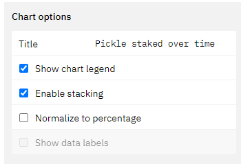
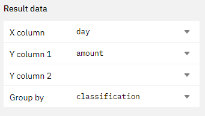
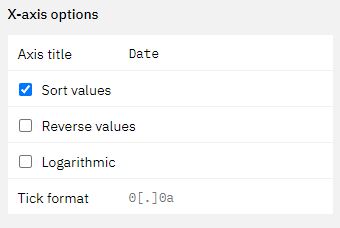
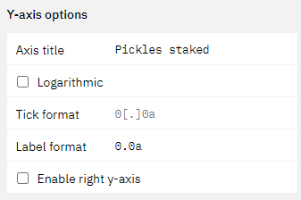
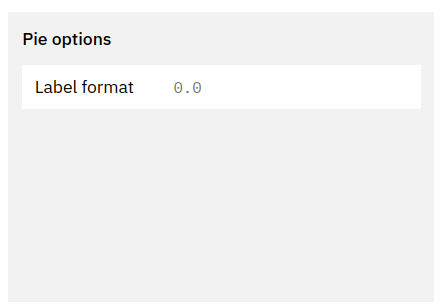
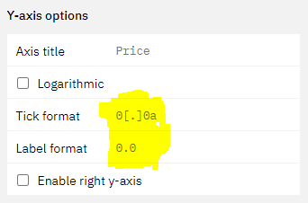

Graphs are great for condensing data points into a Visualization.

With Dune, you can create the following types of graphs:

=== "Bar charts"

    

=== "Area charts"

    

=== "Scatter charts"

    

=== "Line charts"

    

=== "Pie charts"

    

=== "Mixed graphs"

    You can mix all of these graph types together in one Visualization, as long as your base graph isn't a Pie chart:

    

All graph Visualizations share a common set of editing options, see the tabs below for how to configure each.

## Visualization Configuration Options

=== "Chart options"

    This section allows you to define how to display your data.

    

    **Title**

    * The title will appear in all instances of this graph prominently at the top.
    * The graph will always keep the name of the Query, even if you edit this.

    **Show chart legend**

    * Ticking this box will enable or disable the legend for the chart.

    **Enable stacking**

    * If applicable, ticking this box will stack the chart values on top of each other based on the x-axis values.
    * If this is not turned on, the values will be plotted individually on the y-axis.
    * The calculation underpinning this will always group the value corresponding to one value on the x-axis. Make sure your data is clean in able for this to work (avoid gaps in your data).

    **Normalize to percentage data**

    * This will normalize the chart to display percentage values of the chosen data table.
    * The calculation underpinning this will always group the value corresponding to one value on the x-axis. Make sure your data is clean in able for this to work (avoid gaps in your data).

    **Show data labels**

    * Ticking this box leads to the display of the individual datapoints inside of the graph.
    * This only makes sense in cases where you have few datapoints that are spread out far enough from each other to not overlap.

=== "Result data"

    Here you can pick the data points that are to be displayed.

    

    You can choose one **x-axis** and multiple **y-axis.**

    Alternatively, you can also choose one data series on the y-axis and choose to group it by a different column of your table (as shown in the example above).

=== "X-axis options"

    Using these options you can influence how your x-axis data gets displayed.

    

    **Axis title**

    * This field allows you to specify a title for your x-axis.

    **Sort Values**

    * by ticking this box you can specify if you want the values in your chart to be ordered.
    * If your x-axis is a time series, this will automatically happen.

    **Reverse value**

    * Ticking this box will reverse the order of the values on the x-axis.

    **Logarithmic**

    * Ticking this box will make your x-axis values display \_\_ logarithmically.

=== "Y-axis options"

    With these options you can influence how your x-axis data gets displayed.

    

    **Axis title**

    * This field allows you to specify a title for your y-axis.

    **Logarithmic**

    * Ticking this box will make your x-axis values display \_\_ logarithmically.

    **Enable right y-axis**

    * Ticking this box will enable an additional y-axis that you can plot values on.
    * You can choose in the [chart series section](charts-graphs.md#ordering-your-series) what you want to be displayed on the left and right axis.

=== "Series options"

    

    In this section of the Visualization editor you can finalize your graph.

    * You can rename the "series" by simply clicking into the field.
    * You can change the chart type by clicking into the dropdown.
    * You can change the colors by clicking into the color box.
    * Finally you can also change the order of the series.

    **Picking Colors**

    You can pick colors with your browser native color selector.

    This might look slightly different for you depending on which browser you use.

    

=== "Pie options"
    
    
    
    **Label format**

    * This field allows you to define the [tick format](#xy-axis-tick-and-label-formats) of the data labels in your pie chart.

***

## X/Y-axis Tick and Label formats

Tick formats change how numeric values and axis labels in your graphs are displayed.

Here's how to format them:

| Starting Value        | Tick/Label format | Output          | Description                                                                                                                                           |
| ------------ | ----------- | --------------- | ----------------------------------------------------------------------------------------------------------------------------------------------------- |
| 1256784.3745 | `[blank]`  | 1256784.3745000 | Displays the number 7 decimal precision.                                                                                                                |
| 1256784.3745 | `0`           | 1256784         | Displays only the integer.                                                                                                                            |
| 1256784.3745 | `0,0`         | 1,256,784       | Only displays the integer with comma separation.                                                                                                      |
| 1256784.3745 | `0,0.00`      | 1,256,784.38    | Displays the number with [x] decimal precision, where [x] is the number of `0` you add after the decimal point.                                                                |
| 1256784.3745 | `0.0a`     | 1.2M            | 
Displays the number with [x] precision and a letter based on the number's 1e[y] power (eg "m" for million, "b" for billion)  |
| 1256784.3745 | `$0.0a`    | $1.2M           | Adds a "\$" to the number. Works with all formats above though use of the `a` suffix is recommended. Currently the only "\$" is the only supported currency symbol.                                                                                      |