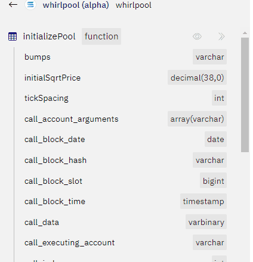

!!!WARNING---
    These tables are still in alpha state, as we are still ironing out some kinks. If you discover any issues, please let us know by [dming on Twitter](https://twitter.com/andrewhong5297).

Decoded tables inherit all of the columns from [`instruction_calls`](../../raw/solana/instruction-calls.md), so you can refer there for most of the types. We only add columns for each argument in the function call `data` and each account that was required to be in `account_arguments`.

## Example IDL Decoded Walkthrough

Using an IDL, we decode the function data arguments and the required account arguments. Let's look at an example using Whirlpool - normally you can find the IDL [on Solscan](https://solscan.io/account/whirLbMiicVdio4qvUfM5KAg6Ct8VwpYzGff3uctyCc#anchorProgramIDL), but this time we had to dig [into the project repo](https://github.com/orca-so/whirlpools/blob/main/sdk/src/artifacts/whirlpool.json). IDLs are like ABIs on Ethereum, except they are created from the [Anchor lang](https://www.anchor-lang.com/) project instead of natively from every program.

[Here's a transaction](https://solscan.io/tx/TGDKvM2E8mWYcsG2JBnb9axFcyEcKqs7yZLyayCmrV8p8SSdA8r9SLEC7EHQ4mcXQXpczEyaCBXvnmEi9yoKVJ9) of a pool (a trading pair) being initialzed.

You can see that the instruction data is decoded in "Bumps", "TickSpacing", and "InitialSqrtPrice" on the explorer. You can also see all the account names are labelled clearly. We have the same thing in a SQL table!



Try it out for yourself in [this query](https://dune.com/queries/2352049) below:

```
SELECT * FROM whirlpool_solana.whirlpool_call_initializePool
WHERE tx_id = 'TGDKvM2E8mWYcsG2JBnb9axFcyEcKqs7yZLyayCmrV8p8SSdA8r9SLEC7EHQ4mcXQXpczEyaCBXvnmEi9yoKVJ9'
```

The table name follows the pattern `<namespace>_solana.<programName>_call_<instructionName>`. We already have many of the top projects decoded, so go play around!