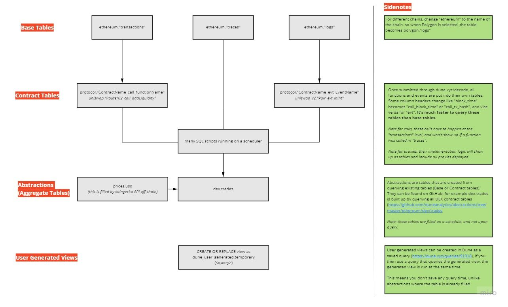

**Dune enables you to query data on our supported chains at different levels of abstraction.**

To start with, you have access to the raw tables for each supported blockchain, with tables like `blocks` and `transactions`. This is the most flexible option.

To make it easier to work with smart contracts, Dune also provides decoded data as individual, human readable tables. We use the ABI for smart contracts and the interface standard for standardized token smart contracts (ERC20, ERC721 etc.). We've indexed over 280k contracts as of writing, and you can [submit new contracts](../app/decoding-contracts.md).

On top of that, we're building a set of [Spells](spells/index.md) for common use cases (e.g. NFTs or DEX) and third party datasets.

Here is an overview what is available:

- [Raw data](raw/index.md): unedited, raw and encoded blockchain data
- [Decoded data](decoded/index.md): (**most popular**) view the decoded calls and events made to smart contracts
- [Spells](spells/index.md): custom tables that are maintained by Dune and our community
- [Community](community/index.md): partnering with select organizations for off-chain data
- [Prices](spells/prices.md): prices from third party data providers
- [User generated](user-generated.md): construct your own view, function or table inside of our database

## Available Chains

Learn about the chains we have available for Querying here:

- [Available Chains](../tables/available-chains.md)

## How Tables are Generated from Raw Ethereum Data

!!! note
    Table generation is similar to this for all EVM based blockchains. The labels below follow Dune V1 naming conventions and are slightly different in Dune V2 Tables. Learn about the [differences in V2's data structure here](../reference/dune-v2/index.md). And learn [how to search V2 data here](../getting-started/queries/data-explorer/#v2).

There are three main tables in Dune generated from raw Ethereum data, which are the source truth for everything else on the platform.

The rest of Dune's tables are built from these three:

If you can't figure out the table to query from, you'll need to dig through an example transaction hash on [the relevant chain's blockchain explorer](../reference/wizard-tools/blockchain-explorers.md) to figure out the call/evt Contract.

Essentially go `tx_hash` → `contract` in "to" → `code` and pull the contract name from there. If it's a proxy, the blockchain explorer should link you to an implementation address. 

Dune V2 data also has a handy Lineage Graph that lets you explore how all of Dune's data tables are related to each other - [learn more about that in the Lineage Graph section here](spells/spellbook-model-docs.md).

You should always try to use the [Decoded](decoded/index.md) or [Spell](spells/index.md) tables when you can as these are human-readable and pre-organized so they're much easier to use.