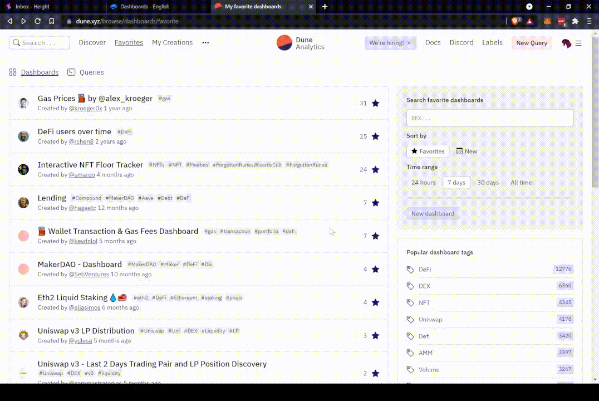
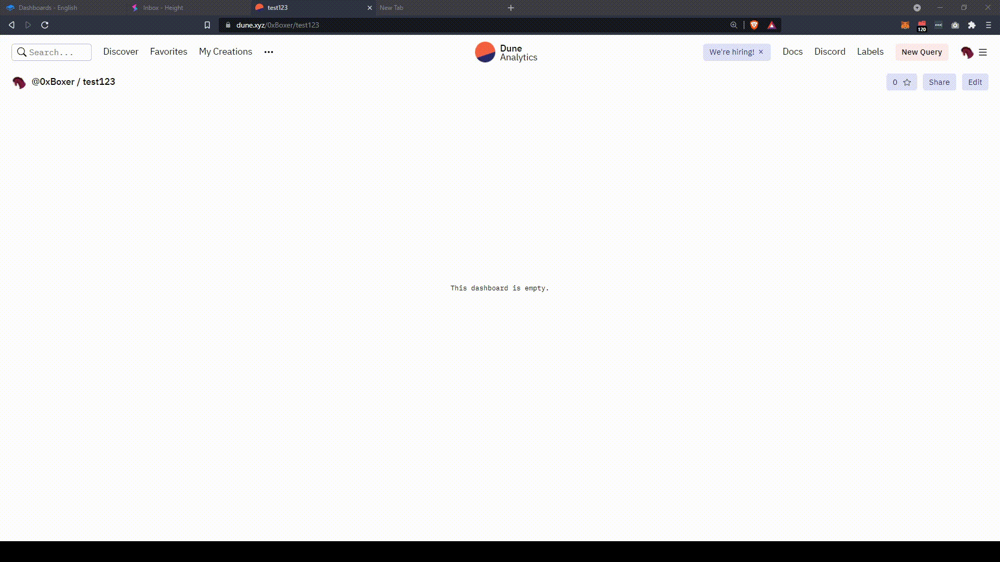
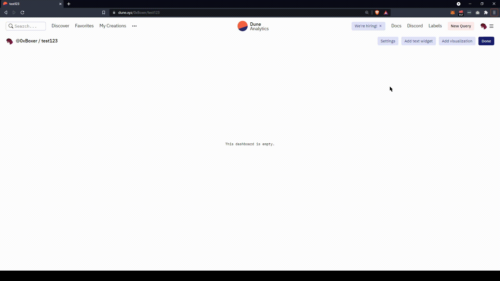

**数据看板是 Dune 的内容存在和被发现的地方。**

Dune 上的数据看板由部件组成。部件可以是可视化的，也可以是一个文本框。也可以在文本框内嵌入图片/GIF。

您可以自由调整每个部件的大小，以配合您想要创建的布局。

## 创建一个看板

您可以通过浏览我们的 "Discover" 页面并点击右侧的 "New dashboard" 按钮来创建一个新的看板。

您给您的看板的初始名称也将是 URL slug。之后您不能改变 URL slug，所以要注意您选择的名字。不过，您总能改变看板的显示名称。



## 添加可视化

您可以通过进入编辑者模式并点击相应的按钮简单地将可视化添加到您的看板中。要进入编辑模式，首先打开一个您自己的看板，然后点击右上方的编辑按钮。



## 添加文本框

要在看板上添加文本框，您必须先进入编辑者模式，然后可以点击 "添加文本部件"。这将打开一个简单的文本编辑窗口。



文本框支持 markdown 的一个子集。您可以处理文本并嵌入图像和 GIF。

### 文本处理

这是一个关于 markdown 语法的简短列表。可以在[这里](dashboards.md#dashboards-are-where-dunes-content-lives-and-gets-discovered.)找到更高级的 markdown 指南。

| 元素                                                                         | Markdown 语法                                                                                    |
| ------------------------------------------------------------------------------- | -------------------------------------------------------------------------------------------------- |
| [标题](https://www.markdownguide.org/basic-syntax/#headings)                 | <p><code># H1</code><br><code>## H2</code><br><code>### H3</code></p>                              |
| [粗体](https://www.markdownguide.org/basic-syntax/#bold)                        | `**粗体文字**`                                                                                    |
| [斜体](https://www.markdownguide.org/basic-syntax/#italic)                    | `*斜体文字*`                                                                                 |
| [有序列表](https://www.markdownguide.org/basic-syntax/#ordered-lists)       | <p><code>1. 第一项</code><br><code>2. 第二项</code><br><code>3. 第三项</code><br></p> |
| [无序列表](https://www.markdownguide.org/basic-syntax/#unordered-lists)   | <p><code>- 第一项</code><br><code>- 第二项</code><br><code>- 第三项</code><br></p>    |
| [代码](https://www.markdownguide.org/basic-syntax/#code)                        | `` `代码` ``                                                                                       |
| [分隔线](https://www.markdownguide.org/basic-syntax/#horizontal-rules) | `---`                                                                                              |
| [链接](https://www.markdownguide.org/basic-syntax/#links)                       | `[标题](https://www.example.com)`                                                                 |

## 嵌入图像和 GIF

我们的文本框也可用于将图像或 GIF 嵌入您的看板。

嵌入图像的语法是：

| [图像](https://www.markdownguide.org/basic-syntax/#images-1) | `` |
| ------------------------------------------------------------- | ------------------------ |

由于您不能在我们的服务器上本地存储图像，您需要在其他地方上传您的图像，或在互联网的某个地方找到原始文件。

在实践中，这可能看起来像这样：

```

--这是一个储存在推特服务器的图像
```
您可以通过简单地调整它所包含的部件的大小来调整图像的大小。

您可以在一个部件中结合图片和文字。


## 安排看板的布局

您可以以任何您喜欢的方式安排看板上的不同部件。

部件总是试图向上移动，所以如果您想在您的看板上创建一个视觉分隔部分，建议创建一个大的文本框作为分隔。


