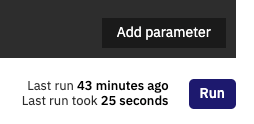

下面您会发现一些与查询相关的技巧，以帮助您成为一名更强大的巫师 🧙。

如果您有一个您认为我们应该添加的技巧贴士，请[在我们的 GitHub repository 中对该文档提出修改意见](https://github.com/duneanalytics/docs/edit/master/docs/features/queries/tips.md)!

## 使用数据抽象和魔法

用 Dune 做很棒的分析的最简单方法是使用您在[魔法](../../reference/tables/spells.md)（Dune V2）和[数据抽象](../../reference/tables/v1/abstractions/index.md)（Dune V1）中发现的整理好的数据。

这些数据表，如`dex.trades`，是清洗过的并包含数据/元数据（如人类可读的代币符号），让它们非常容易查询。

## V1 内联以太坊地址格式

!!! warning
    此功能只在 Dune V1 引擎中可用。

在 Dune 中，以太坊地址被存储为 PostgreSQL 字节数，并以 `\x` 前缀进行编码。这与习惯的 `0x` 前缀不同。如果您想使用一个内联地址，比如说过滤一个给定的代币，您可以这样做

```sql
WHERE token = '\x6b175474e89094c44da98b954eedeac495271d0f'
```

简单来说就是

```sql
WHERE token = '\x6b175474e89094c44da98b954eedeac495271d0f'::bytea
```

## 用 camelCase 引用列名和表名

!!! warning
    此功能只在 Dune V1 引擎中可用。

列和表的名称大多直接取自智能合约的应用二进制接口（ABI），没有任何修改。

由于大多数智能合约是用 Solidity 编写的，而且是用 camelCased 命名惯例编写的，所以 Dune 的许多表和列的名称也是如此。

PostgreSQL（Dune V1） 要求您对列和表名的引用是区分大小写的：

```sql
SELECT “columnName”
FROM projectname.”contractName_evt_EventName”
LIMIT 10
```

在 PostgreSQL 中，双引号是为表和列保留的，而单引号是为值保留的：

```sql
SELECT “columnName”
FROM projectname.”contratName_evt_eventName”
WHERE contract_address = '\x6B175474E89094C44Da98b954EedeAC495271d0F'
LIMIT 10
```
架构在 Dune 中总是小写的。

## 移除小数

以太转账和大多数 ERC-20 代币都有 18 位小数，大多数人类都认为这太多了，无法阅读。

要将这些转换为更人性化的形式，使用 `erc20.tokens` 表，并将代币的 `transfer_value` 除以 10：

=== "PostgreSQL"

    ```sql
    transfer_value / 10^erc20.tokens.decimals
    ```

=== "Databricks SQL"

    ```sql
    transfer_value / x*power(10,y)` or `transfer_value / x*1e*y
    ```

## 用 `date_trunc` 获取时间

我们添加了 `evt_block_time` 来[解析事件表](../../reference/tables/decoded.md)以方便您的使用。

使用它的一个很好的方法是与 `date_trunc` 函数一起使用，像这样：

```sql
SELECT date_trunc('week', evt_block_time) AS time
```

您可以使用 `minute`、`day`、`week`，或者 `month`。

## 如何获取 USD 价格

为了获得链上活动的美元价格，您通常要在给定的 `asset`【资产】的 `minute`【分钟】上，`JOIN` 您正在寻找的智能合约事件的 `prices.usd`：

```sql
LEFT JOIN prices.usd p 
ON p.minute = date_trunc('minute', evt_block_time)
AND event."asset" = p.contract_address
```

然后您可以简单地将智能合约事件的价值或金额与您 `SELECT` 语句中的美元价格相乘：`* p.price`。

## 代币符号

您经常想按代币地址来分组您的结果，例如看 DEX 上按代币分组的交易量。但是，一大堆代币地址的列表是抽象和难以消化！

所以要用代币符号代替。 🪄

要做到这一点，`JOIN` `erc20.tokens` 表与您的事件表，其中`asset`=`{{token_address}}`。然后您在选择语句中选择符号而不是代币地址。

=== "PostgreSQL"

    **请注意** `erc20.tokens` 表包含了一些热门的代币的选择。如果您正在处理比较模糊的代币，您应该小心地与这个表连接（join），因为不在 coincap 表中的代币可能会被排除在您的结果之外。

=== "Databricks SQL"

    **请注意** `tokens_blockchain.erc20` t表包含了一些热门的代币的选择。如果您正在处理比较模糊的代币，您应该小心地与这个表连接（join），因为不在 coincap 表中的代币可能会被排除在您的结果之外。

## 用参数过滤查询和看板

参数可以把您的查询或看板变成区块链数据的应用程序。

点击查询编辑器页上的 SQL 编辑器右下方的 `Add parameter`【添加参数】



双大括号将出现在您的查询中 `{{}}`。放入参数名称，如 `{{token symbol}}` 或 `{{holder address}}`。

注意，如果您想在您的查询中使用参数，您需要加上单引号 `WHERE token = '{{token symbol}}'`.

!!! warning
    此功能只在 Dune V1 引擎中可用。

为了使用户不必为地址输入 `\x`，一个有用的地址格式转化是这样的：

```sql
WHERE contract_address = CONCAT('\x', substring('{{token address}}' from 3))::bytea
```

这使使用您查询的用户在过滤时，只需要简单地黏贴 `0xc00e94cb662c3520282e6f5717214004a7f26888` 而不是 `\xc00e94cb662c3520282e6f5717214004a7f26888` 。
