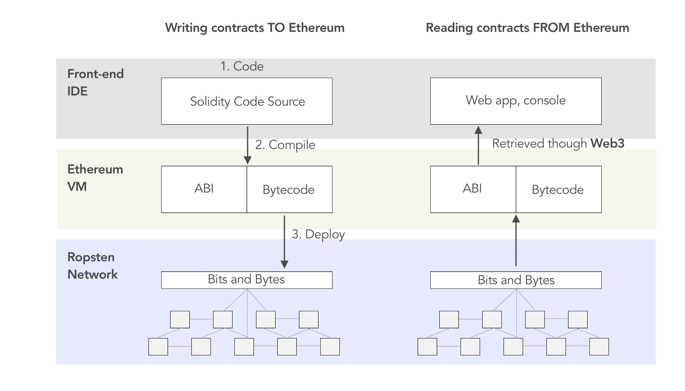

在 Dune 上，我们将智能合约活动解码为易读的表格，而不是处理原始状态下的事件、日志和记录。

我们为智能合约的ABI（应用程序二进制接口）中定义的每个事件和函数创建表。随后，对该合约进行的每个事件、消息调用或交易都进行解码，并作为一行插入这些表中。

表的名称如下：

=== "PostgreSQL"

    **事件:** `projectname."contractName_evt_eventName"`

    **功能调用:** `projectname."contractName_call_eventName"`

    比如, uniswap V2交易对合约的`swap`事件的解码数据可以在这个表找到 [`uniswap_v2."pair_swap"`](https://dune.com/queries/38968).

=== "Databricks SQL"

    **事件:** `projectname_blockchain.contractName_evt_eventName`

    **功能调用:** `projectname_blockchain.contractName_call_eventName`

    比如, uniswap V2以太坊交易对合约的`swap`事件的解码数据可以在这个表找到 `uniswap_v2_ethereum.Pair_evt_Swap`。

如果一个合同有多个实例，我们将把所有实例解码到同一个表中，您将能够使用 `contract_address` 列识别特定的智能合约。

尽管所有链的数据都存储在一个数据库中，但现实中还是多链世界，Dune上的合约都有一个元属性，来描述这个特定表从哪个区块链中提取数据。

**在此处阅读更多关于调用和事件之间的区别:**

=== "PostgreSQL"

  - [调用表](v1/decoded/call-tables.md)
  - [事件日志](v1/decoded/event-logs.md)

=== "Databricks SQL"

  - [调用表](v2/decoded/call-tables.md)
  - [事件日志](v2/decoded/event-logs.md)

## 哪些合约有解码数据?

=== "PostgreSQL"

    您可以通过查询`"blockchain".contracts`来检查合约是否已经解码或使用 [此仪表板](https://dune.com/0xBoxer/Is-my-Contract-decoded-yet).

    ```sql
    Select * from ethereum.contracts
    where address = '\x429881672B9AE42b8EbA0E26cD9C73711b891Ca5'
    ```

=== "Databricks SQL"

    您可以通过查询_`blockchain.`_`contracts` 来检查合约是否已经解码。

    ```sql
    Select * from ethereum.contracts
    where address = '0x429881672B9AE42b8EbA0E26cD9C73711b891Ca5'
    --you can change ethereum.contracts to the e.g. optimism.contracts
    ```

如果合约尚未解码,您可以在这里提交申请: [dune.com/contracts/new](https://dune.com/contracts/new).

通常需要24小时完成解码。

这部分内容将让您了解更多提交合约解码的信息:

<div class="cards grid" markdown>
- [添加新合约](../../getting-started/decoding-contracts.md)
</div>

## 解码是怎样完成的?

任何基于EVM的区块链上的智能合约大多以高级语言编写，比如 [Solidity](https://docs.soliditylang.org/en/v0.8.2) or [Vyper](https://vyper.readthedocs.io/en/stable)。

为了能够将它们部署到EVM执行环境中，需要将它们编译为EVM可执行字节码。一旦部署，字节码就与相应链上的地址相关联，并永久存储在该链的状态存储中。

为了能够与这个现在只是字节码的智能合约交互，我们需要一个能够调用高级语言定义的功能的指南。将名称和参数转换为字节是通过使用 **ABI (Application Binary Interface)** 完成的。

ABI精确地记录了名称、类型和参数，并允许我们使用易读的格式与智能合约进行交互。ABI可以使用高级语言源代码进行编译。

**ABI用于调用智能合约或阐释其发出的记录**



**让我们将此付诸实践，并看一个实际的例子**

我们来看一个ERC20代币转账（$Pickle）的事件 [智能合约](https://etherscan.io/token/0x429881672B9AE42b8EbA0E26cD9C73711b891Ca5#readContract)。

在 [Etherscan](https://etherscan.io/tx/0x2bb7c8283b782355875fa37d05e4bd962519ea294678a3dcf2fdffbbd0761bc5#eventlog) 未解码的数据是这样的:


如果我们在 `ethereum.logs` 中查询此事件，我们将收到与结果数据集相同的编码字节。

=== "PostgreSQL"

    ```sql
    Select
      tx_hash
      ,topic1
      ,topic2
      ,topic3
      ,data
      
      from
      ethereum.logs
    where
    tx_hash = '\x2bb7c8283b782355875fa37d05e4bd962519ea294678a3dcf2fdffbbd0761bc5'
    ```

=== "Databricks SQL"

    ```sql
    Select
      tx_hash
      ,topic1
      ,topic2
      ,topic3
      ,data
      
      from
      ethereum.logs
    where
      1=1
      and tx_hash = '0x2bb7c8283b782355875fa37d05e4bd962519ea294678a3dcf2fdffbbd0761bc5'
      and block_numer = 15145909
    ```

**结果:**

| tx\_hash                                                           | topic1                                                             | topic2                                                             | topic3                                                             | data                                                               |
| ------------------------------------------------------------------ | ------------------------------------------------------------------ | ------------------------------------------------------------------ | ------------------------------------------------------------------ | ------------------------------------------------------------------ |
| 0x2bb7c8283b782355875fa37d05e4bd962519ea294678a3dcf2fdffbbd0761bc5 | 0xddf252ad1be2c89b69c2b068fc378daa952ba7f163c4a11628f55a4df523b3ef | 0x00000000000000000000000075e89d5979e4f6fba9f97c104c2f0afb3f1dcb88 | 0x00000000000000000000000087d9da48db6e1f925cb67d3b7d2a292846c24cf7 | 0x00000000000000000000000000000000000000000000001a894d51f85cb08000 |

**这对我们分析数据并没有什么帮助**

使用合约的ABI，我们可以将编码的字节码转换为解码的数据。

我们在这里查看的事件日志来自$PICKLE ERC20代币 `transfer`事件日志。

因为Dune已解码该数据, 我们可以通过检索 `pickle_finance."PickleToken_evt_Transfer"`来获取解码信息。

=== "PostgreSQL"

    ```sql
    Select
      tx_hash,
      "from",
      "to",
      value
    from
      pickle_finance."PickleToken_evt_Transfer"
    where
      tx_hash = '\x2bb7c8283b782355875fa37d05e4bd962519ea294678a3dcf2fdffbbd0761bc5'
    ```

=== "Databricks SQL"

    ```sql
    Select
      tx_hash,
      "from",
      "to",
      value
    from
      pickle_finance_ethereum.PickleToken_evt_Transfer
    where
      1=1
      and tx_hash = '0x2bb7c8283b782355875fa37d05e4bd962519ea294678a3dcf2fdffbbd0761bc5'
      and block_numer = 15145909
    ```

**结果:**

| evt\_tx\_hash                                                      | "from"                                     | "to"                                       | value                 |
| ------------------------------------------------------------------ | ------------------------------------------ | ------------------------------------------ | --------------------- |
| 0x2bb7c8283b782355875fa37d05e4bd962519ea294678a3dcf2fdffbbd0761bc5 | 0x75e89d5979e4f6fba9f97c104c2f0afb3f1dcb88 | 0x87d9da48db6e1f925cb67d3b7d2a292846c24cf7 | 489509000000000000000 |

**这些信息对我们进行分析就非常有用了！**

它究竟是怎么做到的呢?

由于我们知道我们在这里查看的是哪个事件，所以我们可以根据字节码的数据类型对其进行解码，从而将编码的字节码转换为解码的数据。

ERC20代币的`Transfer`事件日志的结构是这样的:

```solidity
Transfer(address from, address to, uint256 value)
```

这告诉我们，topic2和topic3的类型为`address`（32字节），分别是代币的发送方和接收方。一个事件日志只有3个索引字段，因此`data`字段用于存储有关在该事件中转移了多少代币单位的信息。此字段称为`value`。

由于`topic1`始终只是事件签名的Keccak-256哈希，我们只能解码 `topic2`, `topic3` 和 `data`。

在这种情况下，它们是这样映射的：


| 原始数据域 | 解码数据描述                       | 原始数据                                                           |解码数据                                                                 |
| -------------- | ---------------------------------------------- | ------------------------------------------------------------------ | ----------------------------------------------------------------------------- |
| topic1         | keccak256("Transfer(address,address,uint256)") | 0xddf252ad1be2c89b69c2b068fc378daa952ba7f163c4a11628f55a4df523b3ef | not needed, this table only contains event logs from the `transfer` event log |
| topic2         | from                                           | 0x00000000000000000000000075e89d5979e4f6fba9f97c104c2f0afb3f1dcb88 | 0x75e89d5979e4f6fba9f97c104c2f0afb3f1dcb88                                    |
| topic3         | to                                             | 0x00000000000000000000000087d9da48db6e1f925cb67d3b7d2a292846c24cf7 | 0x87d9da48db6e1f925cb67d3b7d2a292846c24cf7                                    |
| data           | value                                          | 0x00000000000000000000000000000000000000000000001a894d51f85cb08000 | 489509000000000000000                                                         |

**总结:**

我们可以使用合约ABI将编码数据转化为解码数据。这有助于您快速高效地运行分析，因为解码数据更易于处理。

## 我该如何理解解码数据？

解码数据是两个软件通过区块链相互对话的高级编程语言表示。尽管不是很容易理解这些交互中到底发生了什么，但大多数时候，查看列名和在其中传输的数据应该有助于您了解特定日志或调用中发生了什么。
如果您不能通过搜索数据表来了解数据，那么使用事件哈希和以太坊浏览器来查看单个事件通常会有所帮助。此外，查阅智能合约代码（我最喜欢的方法是 [DethCode](https://etherscan.deth.net)）阅读注释或逻辑可以帮助您理解智能合约发出的数据。I
如果这样也不能让您理解数据的话，仔细查看项目的相关文档和GitHub或许可以帮助您。此外，与项目的开发人员和核心社区也可以帮助您了解该合约。 
在Dune上您可以找到关于如何处理解码数据的一些很好的展示，尤其是我们的[魔法书资源库](https://github.com/duneanalytics/spellbook/index.md)里有很多很棒的例子。
S

**总结**:

使用解码数据可以让您深入访问存储在区块链上的丰富信息，但了解数据有时需要您付出一些努力，因为您是以直接方式与合约数据交互的。

## 我该用哪个表数据?

**事件**用于被分析并存储在区块链上，以允许对正在发生的事情进行回溯分析，**交易**和**命令调用**用于在智能合约之间传递信息。因此，在大多数情况下，分析区块链上发生的各种行为的最简单、最容易的方法是查看事件。然而，在某些情况下，事件发出时错过了一些关键信息，或者没有发出任何事件。在这些情况下，您将不得不返回到事件和命令调用（在调用表中找到）。随着时间的推移，事件未发出的情况越来越少见，因为开发人员现在大多都了解这件事的重要性，但这种情况还未完全杜绝。在某些情况下，将解码后的数据与[原始数据]（raw.md）结合起来，以获取关于事件的元数据或深入研究，可能是有效的办法。

## 探索解码合约的检索

**探索我们已解码的项目**

=== "PostgreSQL"

    ```sql
    SELECT DISTINCT namespace FROM ethereum."contracts";
    ```

=== "Databricks SQL"

    ```sql
    SELECT DISTINCT namespace FROM blockchain.contracts;
    --change blockchain.contracts to e.g. ethereum.contracts
    ```
如果您直接处理事件或调用表，您可以查看该查询中是否存在该合约的多个实例。 

=== "PostgreSQL"

    ```sql
    SELECT DISTINCT contract_address FROM projectname."contractName_evt_eventName";
    ```

=== "Databricks SQL"

    ```sql
    SELECT DISTINCT contract_address 
    FROM projectname_blockchain.contractName_evt_eventName;
    --change blockchain.contracts to e.g. ethereum.contracts
    ```

