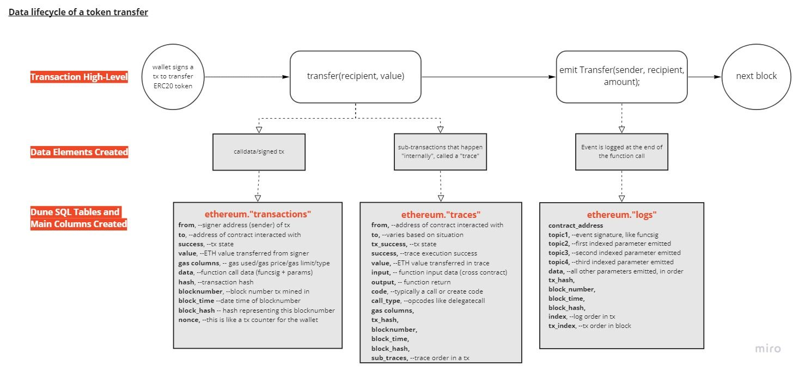

**Dune 支持以不同的抽象级别查询已接入的链上数据。**

您可以从已接入的区块链原始表开始，例如像 `blocks` 和 `transactions` 数据表。这些原始表有着最原始的链上数据，可用于灵活的数据分析。

与此同时，为了更轻松地分析智能合约，Dune还提供了具有可读性的解码数据表。我们使用智能合约的 ABI (Application Binary Interface) 和标准化代币智能合约的接口标准（ERC20、ERC721 等）用于解码数据。截止撰写此文档时，我们已经索引了超过超过 28 万份智能合约。您可以[在此提交新的合约](../../getting-started/decoding-contracts.md)与Dune进行解码。

此外，我们正在将常用链上数据（如 NFT 与 DEX 数据）和第三方数据集共同构建组成一系列[魔法](spells.md)。

以下是可用内容的概览：

- [原始数据](raw.md): 未经编辑、原始编码的区块链数据
- [已解析数据](decoded.md): (**目前使用最广泛的数据源**) 经过解码后的智能合约事件及调用数据
- [魔法](spells.md): 由Dune和社区一起维护建设的数据表
- [社区](community.md): 由指定合作组织提供的链下数据源
- [价格](prices.md): 由第三方数据源提供的代币价格数据
- [用户自建](user-generated.md): 在我们的数据库中构建您自定义的视图、函数或数据表

数据模型的细节取决于区块链和引擎。 我们已为 [Dune V1 引擎](v1/raw/index.md) (PostgreSQL) 以及 [Dune V2 引擎](v2/raw/index.md) (Databricks SQL) 上的数据编制了详细的参考资料。

## How Tables are Generated from Raw Ethereum Data

!!! note
    Table generation is similar to this for all EVM based blockchains. The labels below follow Dune V1 naming conventions and are slightly different in Dune V2 Tables. Learn about the [differences in V2's data structure here](../dune-v2/index.md). And learn [how to search V2 data here](../../getting-started/queries/data-explorer/#v2).

There are three main tables in Dune generated from raw Ethereum data, which are the source truth for everything else on the platform.

The rest of Dune's tables are built from these three:

If you can't figure out the table to query from, you'll need to dig through an example transaction hash on [the relevant chain's blockchain explorer](../../reference/wizard-tools/blockchain-explorers.md) to figure out the call/evt Contract.

Essentially go `tx_hash` → `contract` in "to" → `code` and pull the contract name from there. If it's a proxy, the blockchain explorer should link you to an implementation address. 

Dune V2 data also has a handy Lineage Graph that lets you explore how all of Dune's data tables are related to each other - [learn more about that in the Lineage Graph section here](../spellbook/spellbook-model-docs/).

You should always try to use the [Decoded](decoded.md) or [Spell](spells.md) tables when you can as these are human-readable and pre-organized so they're much easier to use.