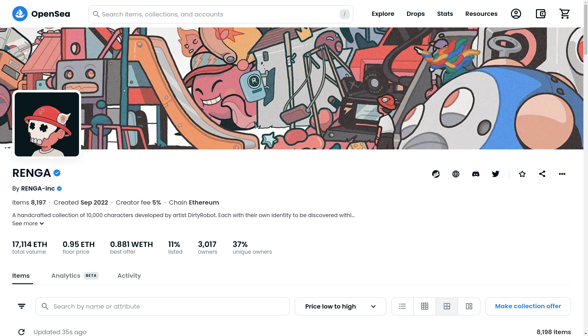

让我们学习如何立即创建魔法表 - 就像 💫！

在本指南结束时，您将设置好本地环境以及为自己创建魔法表或领取赏金所需的知识。

让我们做一些开源区块链数据分析。🧙

## 什么是魔法书（Spellbook）？

魔法书是一个开源的 [dbt 存储库](https://docs.getdbt.com/docs/introduction)，用于使用 SQL 和 [Jinja 模板](https://realpython.com/primer-on-jinja-templating/) 创建和维护高级区块链数据表。

它使社区能够建立一种标准化的方式，将数据转换为有意义的抽象层。

对于 web3 数据，我们有一个基础层 [原始数据](../../reference/tables/raw/index.md) - 区块链交易、内部交易表和日志表。

魔法书让我们可以创建抽象的数据集，例如 [dex.trades](https://dune.com/spellbook#!/model/model.spellbook.dex_trades) 和 [nft.trades](https://dune.com/ spellbook#!/model/model.spellbook.nft_trades)，它们聚合和组织了来自多个来源的原始数据，使其更容易查询。

## 为什么用魔法书？

为了更好地理解我们为什么使用魔法书，让我们来看看它的实际应用。

曾几何时，加密 Twitter 因谈论一个名为 Renga 的新 NFT 项目而火起来。

这个项目是关于什么的？作为投资值得购买它吗？

如果我们想进行一些链上分析，我们可以从转到 OpenSea 并找到 Renga 集合开始（[此处](https://opensea.io/collection/renga)）。



[通过查看此集合中的项目](https://opensea.io/assets/ethereum/0x394e3d3044fc89fcdd966d3cb35ac0b32b0cda91/6294)，我们可以从其 OpenSea URL 中获取集合的合约地址以及唯一编号。


我们还可以向下滚动并单击交易以 [在区块链浏览器上查看](https://etherscan.io/tx/0x96f158d75379057d95c1c562b9908603e543feee25a71ac420e21ecf0a0c643c) 并获取更多数据。例如：

* 交易区块和哈希
* 转账的收/发地址
* 转移了多少 ETH

在基础层面，区块链数据被打包成块，这是我们在 Dune 中称为“原始数据”的一种形式。

因此，根据我们的研究，我们可以构建一个查询，从发生此交易的区块中提取数据。

```sql

SELECT *

FROM ethereum.blocks

WHERE number = 15661624 -- 我们在 etherscan 中找到的区块编号

```

返回：


这个区块中发生了很多事情，所以这不是很有针对性。另外，这里的数据也不是很容易理解。

我们还可以搜索此特定交易以更接近我们的目标：

```sql

SELECT *

FROM ethereum.transactions

-- 我们在 etherscan 中找到的交易哈希值

WHERE where block_number = 15661624 AND hash = '0x96f158d75379057d95c1c562b9908603e543feee25a71ac420e21ecf0a0c643c'

```

这让我们得到：


这里有一些更有趣的信息，比如 `gas_price` 和 `gas_used`，但最有趣的东西在 `data` 列中。但是，为了理解这些，我们需要引用合约的 [应用程序二进制接口（ABI）](https://www.quicknode .com/guides/smart-contract-development/what-is-an-abi)。

值得庆幸的是，Dune 有[已解析数据表](../../reference/tables/decoded/index.md)，其中包含使用 ABI 从交易的原始数据自动解析的合约数据——机器为我们节省了时间。

使用已解析数据表，我们可以像这样进行查询：

```sql

SELECT *

    , concat('0x',substr(get_json_object(offer[0], "$.token"),3,40)) as token_contract_address

    , get_json_object(consideration[0], "$.identifier") as token_id

FROM seaport_ethereum.Seaport_evt_OrderFulfilled

WHERE evt_tx_hash = lower("0x96f158d75379057d95c1c562b9908603e543feee25a71ac420e21ecf0a0c643c") --sample tx

```

执行查询会返回这样的数据：


这里发生了什么事：

* 我们在 Dune 中挖掘以找到 `seaport_ethereum` 合约集和包含我们特定交易数据的 `Seaport_evt_OrderFulfilled` 表。（这本身就需要很多时间）。
* 为了更接近我们真正想要的东西，代币合约地址和代币编号，我们必须：
     * 知道寻找报价列并获得该数组中的第一个位置
     * 让它成为一个 JSON 对象，知道代币合约是 20 个字节，这意味着 40 个字符。
     * 对代币编号进行类似数量的手动抽象

然而现在我们仍然没有得到一些有趣的东西，比如这个 NFT 卖了多少钱。

如果我们想到达那里，就必须有人做这个抽象工作。

但是，如果一旦这项工作第一次完成，社区的其他人就可以跳过所有的噪音直接获得有趣的见解呢？

进入魔法书和 nft.trades 魔法表。

## nft.trades

使用 [nft.trades](https://dune.com/spellbook#!/model/model.spellbook.nft_trades) 魔法表，我们可以这样做：

```sql

SELECT

    seller

    , buyer

    , amount_original

    , currency_symbol

    , *

FROM nft.trades

WHERE tx_hash = lower("0x96f158d75379057d95c1c562b9908603e543feee25a71ac420e21ecf0a0c643c") --sample tx

```

它将返回：


现在，通过几行 SQL就我们可以看到：

* 买卖双方钱包地址
* 以何种加密货币支付的具体金额
* 它在哪个区块链上

以及更多！

这说明在微观层面上，对于一次交易，由于先于我们的巫师完成的魔法表，我们可以节省大量工作。

这当然也适用于宏观层面。

、如果我们想进行跨链 NFT 市场分析，我们的目标可能是构建类似这样的数据看板：

<div class="cards grid" markdown>
- [Cross Chain NFT Marketplace Metrics by @agaperste](https://dune.com/agaperste/cross-chain-nft-marketplace-metrics)
</div>

通过 nft.trades 魔法表，我们可以看到整个行业的统计数据，例如：

* 按交易数量和美元计算的总交易量
* 24 小时交易量
* 24小时和7天的增长量
* 按市场划分的市场份额
* 按市场划分的交易额
* 按市场划分的交易数量

我们可以在几个小时而不是几十个小时内查询、可视化并利用这些数据制作数据看板。

一旦推出新的 NFT 市场，社区中任何知道如何创建魔法表的人都可以为该市场进行数据工程，向魔法书仓库提交合并请求，并让整个社区从他们的工作中受益。

由于区块链，我们历史上第一次可以访问开放数据集。

多亏了魔法书，我们都可以在开放数据的基础上进行构建，使其更加透明、可访问和有意义！

## 八步创建魔法书

既然您知道是什么以及为什么，让我们看看如何做。

在本指南结束时，您将成为一名大巫师，准备好为 web3 数据社区做出巨大贡献，并能够获得一些丰厚的魔法书赏金。

8个步骤：

<div class="cards grid" markdown>
- [1. 💻 准备一些先决条件并且设置好魔法书 dbt](1-do-some-prerequisites%20and-set-up-Spellbook-dbt.md)
- [2. 🤔 决定要创建为魔法表的目标](2-decide-on-a-Spell-to-cast.md)
- [3. 🛣️ 为 SQL、模式和源文件设置文件结构](3-set-up-your-file-structure-for-SQL-schema-and-source-files.md)
- [4. 📙 识别和定义依赖源](4-identify-and-define-sources.md)
- [5. 🧪 使用模式和测试定义期望输出](5-define-expectations-with-schema-and-tests.md)
- [6. 🖋️ 将您的魔法表写成 SELECT 语句](6-write-your-spell-as-SELECT-statement.md)
- [7. 🎨 配置别名和物化策略](7-configure-alias-and-materialization-strategy.md)
- [8. 🌈 提交合并请求，合并，成为大巫师 🧙](8-make-a-pull-request-get-merged-become-an-archwizard.md)
</div>

如果您更喜欢观察，请查看此处的研讨会视频：

