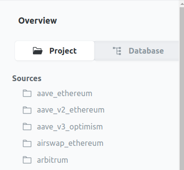
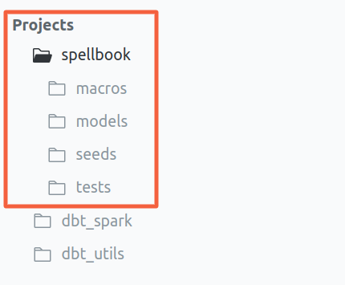
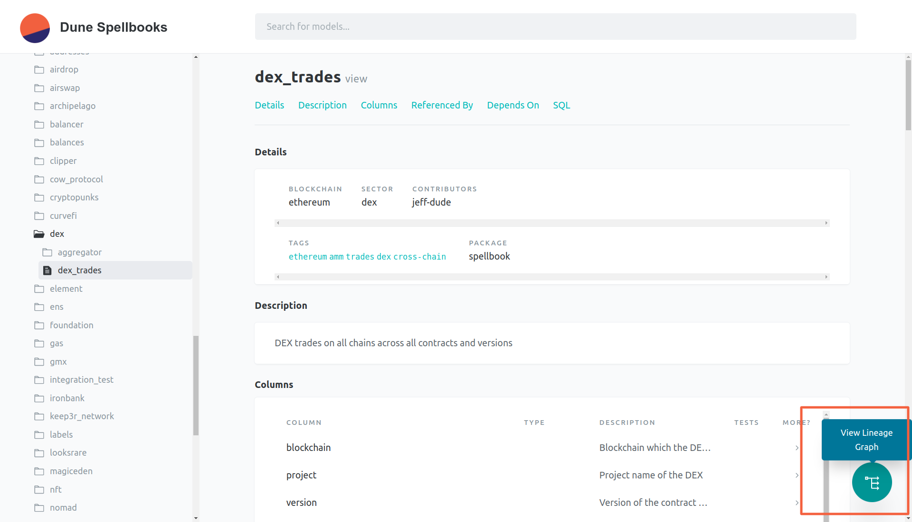
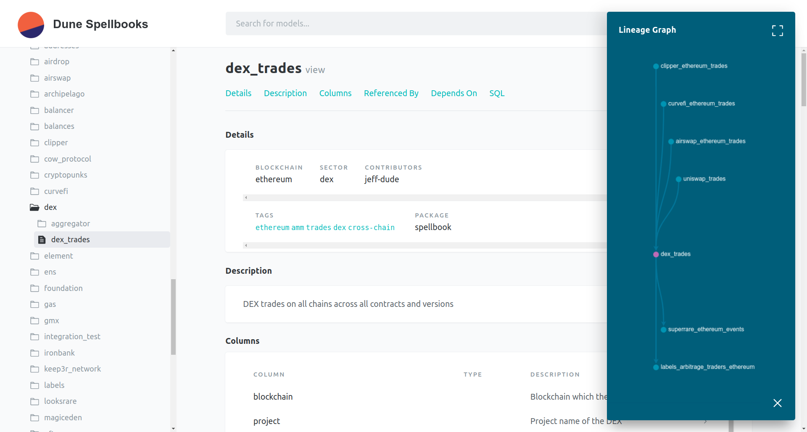
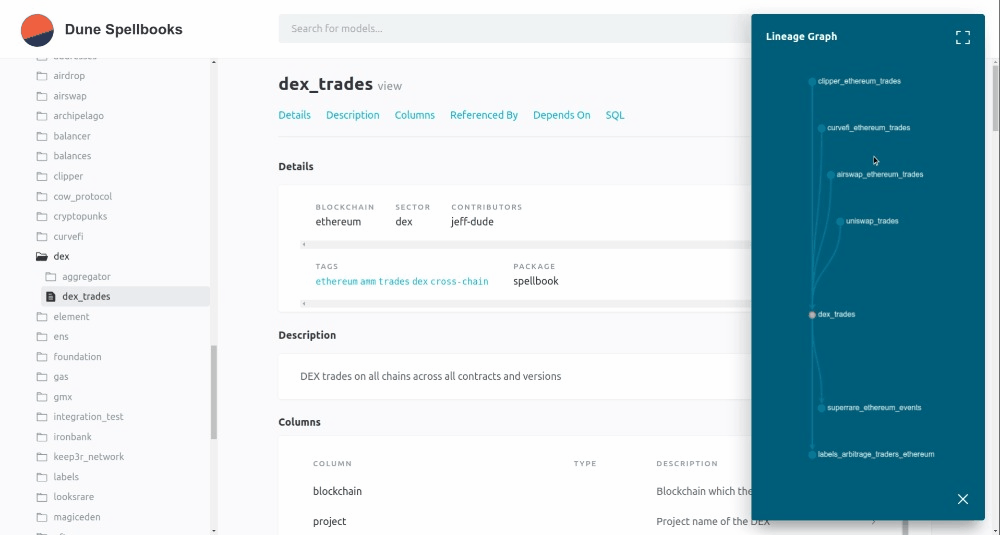

魔法书配有专门的 dbt 文档，以帮助您浏览其中的数据! 可以在这里找到它：

- [魔法书模型文档](https://dune.com/spellbook)

这些内容和 [V2的表数据文档](../../tables/v2/raw/)很类似，不过有一些特殊的功能。

!!! warning
  这些魔法书文档和魔法书数据湖（lake）是一项正在进行的工作。如果您无法找到一个特定的 V2 表/列，它很可能还没有准备好在魔法书中使用。如果您找到了它，但它在魔法书模型文档中还没有完整的标签，请查看我们的 [V2 数据表文档](../../tables/v2/raw/)。如果您仍然有问题，请在 [#data-tables Discord 频道](https://discord.com/channels/757637422384283659/757893948428517376)提出来。

## 导航

您可以使用窗口左侧的项目和数据库导航标签来探索魔法书模型，也可以使用顶部的搜索栏。

## 项目窗口

项目标签是您可以找到数据源（sources）和魔法书模型的地方。

### 数据源模型

[数据源](../spellbook/getting-started/data-sources.md) 是由 Dune V2 数据湖中的数据表建立的 dbt 数据模型。

在使用魔法书之前，数据必须首先被拉入魔法书的数据源模型，所以通过这个列表，您可以了解哪些数据可以在您的魔法书中使用，以及哪些数据可能需要先作为数据源模型被添加。

比如，[Arbitrum blocks](../../tables/v2/raw/arbitrum/blocks/) 数据在魔法书中可用，但是 [Arbitrum event logs](../../tables/v2/raw/arbitrum/event-logs/) 则不行。

### 魔法书模型

在 Sources 下面，您会发现一个 Projects 目录，这里唯一重要的是 Spellbook 文件夹，它包含了与莫发表有关的各种代码和数据表的文档。

- **Macros** 包含使魔法书正常工作的函数
- **Models** 包含[魔法](../spellbook/getting-started/spells.md)
- **Seeds** 包含用于测试的静态数据
- **Tests** 包含[单元测试](../spellbook/getting-started/tests.md)确保魔法按预期工作。

## 脉络图
您可以点击页面右下角的蓝色图标，查看您正在看的模型的脉络图：

在脉络图中，您会看到当前模型的直系父系和子系模型。

点击这个脉络图右上方的 "扩展 "按钮，可以看到所有用于建立或从当前的模型中衍生的模型。

展开后点击任何模型名称，就可以突出显示其相关的父/子模型。

您也可以在模型上点击右键，以互动方式探索和过滤图表：

最后，在底部有多种过滤图表的选项：

